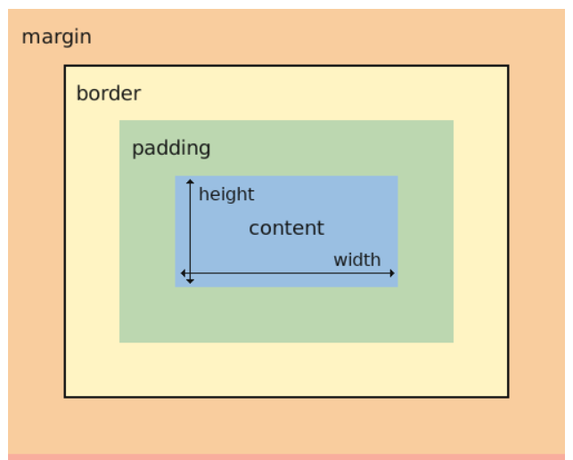

Tugas 6
1. Jelaskan perbedaan antara asynchronous programming dengan synchronous programming.
    - Pemrograman sinkron dan asinkron adalah dua pendekatan berbeda untuk mengeksekusi kode. Berikut perbedaan utama antara keduanya:
    Pemrograman Sinkron:
    a. Tugas dilakukan satu per satu dan dalam urutan tertentu.
    b. Setiap tugas harus menunggu tugas sebelumnya selesai sebelum dapat dimulai.
    c. Kode dijalankan secara berurutan, dan program menunggu setiap tugas selesai sebelum melanjutkan ke tugas berikutnya.
    d. Pemrograman sinkron lebih sederhana dan mudah untuk dikodekan.
    e. Ini didukung dengan baik di antara semua bahasa pemrograman.
    f. Ini paling cocok untuk situasi di mana tugas harus diselesaikan dalam urutan tertentu dan waktu bukan merupakan faktornya.

    Pemrograman Asinkron:
    a. Tugas dapat dijalankan secara paralel dan tidak perlu menunggu satu sama lain.
    b. Kode dijalankan secara bersamaan, dan program tidak menunggu setiap tugas selesai sebelum melanjutkan ke tugas berikutnya.
    c. Pemrograman asinkron lebih kompleks dan dapat memperumit banyak hal.
    d. Ini lebih cepat daripada pemrograman sinkron karena tugas dapat dijalankan secara paralel.
    e. Lebih mudah untuk melakukan penskalaan karena beberapa tugas dapat dijalankan secara bersamaan.
    f. Ini paling cocok untuk situasi di mana beberapa tugas perlu dijalankan pada waktu yang sama, dan hasil dari setiap tugas diperlukan untuk melanjutkan program.

    Singkatnya, pemrograman sinkron lebih sederhana dan mudah untuk dikodekan, sedangkan pemrograman asinkron lebih kompleks tetapi lebih cepat dan mudah untuk diskalakan. Pilihan antara pemrograman sinkron dan asinkron bergantung pada tujuan program dan situasi spesifik.

2. Dalam penerapan JavaScript dan AJAX, terdapat penerapan paradigma event-driven programming. Jelaskan maksud dari paradigma tersebut dan sebutkan salah satu contoh penerapannya pada tugas ini.

    - Pemrograman berbasis peristiwa, juga dikenal sebagai paradigma pemrograman berbasis peristiwa, adalah paradigma pemrograman yang inti programnya ditentukan oleh peristiwa atau kejadian eksternal, seperti penggunaan mouse, keyboard, atau keyboard fisik. Peristiwa yang terjadi mungkin termasuk sensor atau diprogram (transmisi pesan) dari program atau thread lain. Dalam aplikasi berbasis peristiwa, sering kali terdapat loop utama yang menangani peristiwa dan kemudian memicu fungsi panggilan balik ketika peristiwa yang relevan terdeteksi. Teka-teki ini dapat diterapkan ke banyak bahasa pemrograman, termasuk JavaScript, yang mendukung program berbasis peristiwa. Contoh pertama bagaimana tugas ini dilakukan adalah dengan melakukan penyegaran otomatis pada menu tingkat atas untuk menampilkan daftar terbaru tanpa harus memuat ulang seluruh halaman.

3. Jelaskan penerapan asynchronous programming pada AJAX.

    - Pemrograman asinkron AJAX dilakukan dengan memanfaatkan teknologi transmisi data asinkron antara browser dan server web. AJAX memungkinkan transmisi data atau permintaan ke server tanpa menunggu respon dari server. Hal ini memungkinkan perangkat lunak untuk terus berjalan dan menyelesaikan tugas lain sambil menunggu respons server. Setelah menerima respon dari server, perangkat lunak akan mengaktifkan fungsi callback untuk menangani respon tersebut. Hasilnya, pengguna dapat terus menggunakan perangkat lunak tersebut tanpa harus menunggu proses permintaan dan jawaban selesai. Contoh penerapannya pada tugas ini adalah menampilkan list terbaru tanpa reload seluruh halaman dengan melakukan refresh pada halaman utama secara asinkronus.

4. Pada PBP kali ini, penerapan AJAX dilakukan dengan menggunakan Fetch API daripada library jQuery. Bandingkanlah kedua teknologi tersebut dan tuliskan pendapat kamu teknologi manakah yang lebih baik untuk digunakan.

    - Fetch API dan jQuery adalah dua teknologi yang dapat digunakan dalam pengembangan AJAX. Fetch API adalah teknologi JavaScript yang sangat baru dan asli, sedangkan jQuery adalah perpustakaan yang sudah lama ada. Fetch API memiliki antarmuka yang lebih ramah pengguna dan aman, serta kemampuan mengirim permintaan data tanpa menunggu respons dari server. Fetch API juga dapat menyediakan dan menerima data dalam berbagai format seperti XML, JSON, TEXT, dan HTML. jQuery, di sisi lain, memiliki sintaks yang lebih kompleks dan memerlukan penggunaan perpustakaan, meskipun fungsinya terbatas di berbagai browser. Pilihan antara Fetch API dan jQuery ditentukan oleh kebutuhan dan preferensi pengguna. Namun, Fetch API mungkin menjadi pilihan yang lebih menarik karena antarmukanya yang lebih sederhana dan kuat, serta kemampuannya untuk menangani permintaan data secara asinkron.

5. Jelaskan bagaimana cara kamu mengimplementasikan checklist di atas secara step-by-step (bukan hanya sekadar mengikuti tutorial).
    - saya Buat fungsi baru pada views.py dengan nama get_product_json yang menerima parameter request. Kemudian saya buat fungsi baru pada views.py dengan nama add_product_ajax yang menerima parameter request. kemudian saya routing kedua fungsi tersebut dengan mengimpornya lebih dahulu lalu menambahkan kode
    ```python
    path('get-product/', get_product_json, name='get_product_json'),
    path('create-product-ajax/', add_product_ajax, name='add_product_ajax')
    ```
    - saya buka berkas main.html pada main/templates dan hapuslah bagian kode table yang sudah saya buat pada tutorial sebelumnya. kemudian saya tambahkan kode untuk tabel 
    ```html
    <table id="product_table"></table>
    ```

    - kemdian saya buat block Script di bagian bawah berkas saya dan buatlah fungsi baru pada block Script tersebut dengan nama getProducts(). dan saya buat fungsi baru pada block Script dengan nama refreshProducts() yang digunakan untuk me-refresh data produk secara asynchronous.
    ```html
    <script>
    async function getProducts() {
        return fetch("").then((res) => res.json())
    }
    async function refreshProducts() {
    document.getElementById("product_table").innerHTML = "";
    const products = await getProducts();
    let htmlString = '<div class="d-flex flex-row flex-wrap">';  // Flex container

    products.forEach((item, index) => {
        const cardClass = index === products.length - 1 ? 'bg-warning' : '';  // Add bg-warning class for the last card
        htmlString += `
            <div class="card m-3 ${cardClass}" style="width: 18rem;">
                <div class="card-body">
                    <h5 class="card-title">Name: ${item.fields.name}</h5>
                    <p class="card-text">Amount: ${item.fields.amount}</p>
                    <p class="card-text">Description: ${item.fields.description}</p>
                    <div class="row">
                        <div class="col">
                            <button class="delete-button" data-item-id="${item.pk}">Hapus</button>
                        </div>
                    </div>
                </div>
            </div>`;
    });

    htmlString += '</div>';  // Close flex container
    document.getElementById("product_table").innerHTML = htmlString;

    document.getElementById("product_table").innerHTML = htmlString;

    // Menambahkan event listener untuk setiap tombol hapus
    document.querySelectorAll('.delete-button').forEach((button) => {
    button.addEventListener('click', async () => {
        const itemId = button.getAttribute('data-item-id');
        console.log('Button clicked. Item ID:', itemId);
        await deleteProduct(itemId);
        refreshProducts(); // Refresh tabel setelah menghapus item
    })});
    refreshProducts()
    </script>
    ```
    - kemudian saya tambahkan button dan kode dibawah untuk mengaplikasikan modal menggunakan bootstrap
    ```html
    <div class="modal fade" id="exampleModal" tabindex="-1" aria-labelledby="exampleModalLabel" aria-hidden="true">
                <div class="modal-dialog">
                    <div class="modal-content">
                        <div class="modal-header">
                            <h1 class="modal-title fs-5" id="exampleModalLabel">Add New Product</h1>
                            <button type="button" class="btn-close" data-bs-dismiss="modal" aria-label="Close"></button>
                        </div>
                        <div class="modal-body">
                            <form id="form" onsubmit="return false;">
                                
                                <div class="mb-3">
                                    <label for="name" class="col-form-label">Name:</label>
                                    <input type="text" class="form-control" id="name" name="name"></input>
                                </div>
                                <div class="mb-3">
                                    <label for="amount" class="col-form-label">Amount:</label>
                                    <input type="number" class="form-control" id="amount" name="amount"></input>
                                </div>
                                <div class="mb-3">
                                    <label for="description" class="col-form-label">Description:</label>
                                    <textarea class="form-control" id="description" name="description"></textarea>
                                </div>
                            </form>
                        </div>
                        <div class="modal-footer">
                            <button type="button" class="btn btn-secondary" data-bs-dismiss="modal">Close</button>
                            <button type="button" class="btn btn-primary" id="button_add" data-bs-dismiss="modal">Add Product</button>
                        </div>
                    </div>
                </div>
            </div>
            <button type="button" class="btn btn-primary" data-bs-toggle="modal" data-bs-target="#exampleModal">Add Product by AJAX</button>
    ```

    - kemudian saya tambahkan data product dan fungsi onclick untuk menjalankan add product
    ```html
    <script>
    ...
    function addProduct() {
        fetch("", {
            method: "POST",
            body: new FormData(document.querySelector('#form'))
        }).then(refreshProducts)

        document.getElementById("form").reset()
        return false
    }
    document.getElementById("button_add").onclick = addProduct
    </script>
    ```

    - implementasi bonus saya tambahkan code berikut pada html saya
    ```html
    <script>
        async function deleteProduct(item_id) {
        try {
            const csrftoken = getCsrfToken();
            const response = await fetch(`/delete_item/${item_id}/`, {
                method: 'DELETE',
                headers: {
                    'Content-Type': 'application/json',
                    'X-CSRFToken': csrftoken,
                },
            });

            if (!response.ok) {
                throw new Error('Gagal menghapus produk.');
            }

            const data = await response.json();
            console.log(data.message);
            // Logika atau pembaruan tampilan sesuai kebutuhan
        } catch (error) {
            console.error('Terjadi kesalahan:', error);
        }
    }

    // Fungsi untuk mendapatkan nilai csrftoken
    function getCsrfToken() {
        // Gantilah dengan cara mendapatkan csrftoken sesuai dengan proyek atau framework yang kamu gunakan
        // Misalnya, jika menggunakan Django, bisa menggunakan document.querySelector('[name=csrfmiddlewaretoken]').value
        return document.querySelector('[name=csrfmiddlewaretoken]').value;
    }


        async function refreshProducts() {
    document.getElementById("product_table").innerHTML = "";
    const products = await getProducts();
    let htmlString = '<div class="d-flex flex-row flex-wrap">';  // Flex container

    products.forEach((item, index) => {
        const cardClass = index === products.length - 1 ? 'bg-warning' : '';  // Add bg-warning class for the last card
        htmlString += `
            <div class="card m-3 ${cardClass}" style="width: 18rem;">
                <div class="card-body">
                    <h5 class="card-title">Name: ${item.fields.name}</h5>
                    <p class="card-text">Amount: ${item.fields.amount}</p>
                    <p class="card-text">Description: ${item.fields.description}</p>
                    <div class="row">
                        <div class="col">
                            <button class="delete-button" data-item-id="${item.pk}">Hapus</button>
                        </div>
                    </div>
                </div>
            </div>`;
    });

    htmlString += '</div>';  // Close flex container
    document.getElementById("product_table").innerHTML = htmlString;

    document.getElementById("product_table").innerHTML = htmlString;

    // Menambahkan event listener untuk setiap tombol hapus
    document.querySelectorAll('.delete-button').forEach((button) => {
    button.addEventListener('click', async () => {
        const itemId = button.getAttribute('data-item-id');
        console.log('Button clicked. Item ID:', itemId);
        await deleteProduct(itemId);
        refreshProducts(); // Refresh tabel setelah menghapus item
    })});

    }}
    refreshProducts()
    </script>
    ```

    Link tautan : http://aaron-kwek-tugas.pbp.cs.ui.ac.id/ 

Tugas 1
1. Jelaskan bagaimana cara kamu mengimplementasikan checklist di atas secara step-by-step (bukan hanya sekadar mengikuti tutorial).
    1. Membuat sebuah proyek Django baru.
        - hal ini saya lakukan dengan membuat sebuah direktori baru kemudian dilanjutkan dengan membuat lingkungan virtual, setelah itu saya menginstal modul modul yang diperlukan, kemudian dilanjutkan dengan membuat proyek django. Saya mengatur ALLOWED_HOSTS di settings.py untuk keperluan deployment dan jadi proyek django baru
    2. Membuat aplikasi dengan nama main pada proyek tersebut.
        - saya menjalankan perintah python manage.py startapp main, kemudian saya mendaftarkannya pada file settings.py dengan menambahkannya ke dalam variabel INSTALLED_APPS
    3. Membuat model pada aplikasi main dengan nama Item dan memiliki atribut wajib.
        - saya membuka berkas models.py pada direktori aplikasi main, kemudian saya mengisi berkas tersebut dengan model bernama item beserta atribut wajibnya seperti name sebagai nama item dengan tipe CharField, amount sebagai jumlah item dengan tipe IntegerField dan description sebagai deskripsi item dengan tipe TextField. Terakhir saya lakukan migrasi model dan migrasi ke dalam basis data lokal.
    4. Membuat sebuah fungsi pada views.py untuk dikembalikan ke dalam sebuah template HTML yang menampilkan nama aplikasi serta nama dan kelas kamu.
        - mengimport modul yang telah diinstall kemudian menambahkan fungsi untuk mengambil 2 variabel yang kemudian akan dikirimkan ke templete main.html sebagai konteks bagi laman web. Terakhir saya membuat 2 variabel tersebut menjadi statis sesuai dengan sintaks django agar dapat menampilkan nilai dari fungsi
    5. Membuat sebuah routing pada urls.py aplikasi main untuk memetakan fungsi yang telah dibuat pada views.py
        - diawal saya melakukan konfigurasi routing URL aplikasi main dengan menambahkan url patterns path('', show_main, name='show_main') kemudian saya juga lakukan konfigurasi urls.py pada proyek
    6. Melakukan deployment ke Adaptable terhadap aplikasi yang sudah dibuat sehingga nantinya dapat diakses oleh teman-temanmu melalui Internet.
        - setelah memastikan semua langkah telah berjalan selanjutnya saya lakukan git add, commit dan push lalu saya deploy app saya, dengan memilih templete, database, dan versi python yang sesuai, tidak lupa menambahkan commandnya di adaptable. Aplikasi sudah bisa dilihat oleh teman teman.

2. Buatlah bagan yang berisi request client ke web aplikasi berbasis Django beserta responnya dan jelaskan pada bagan tersebut kaitan antara urls.py, views.py, models.py, dan berkas html
    
    Dalam pengembangan web menggunakan Django, terdapat beberapa berkas yang saling terkait, yaitu urls.py, views.py, models.py, dan berkas HTML. 

    urls.py dengan views.py, Berkas ini berisi daftar URL yang dapat diakses oleh pengguna. Berkas ini berfungsi sebagai penghubung antara URL dan view dimana setiap url diarahkan ke view yang ada di views.py. Saat pengguna mengakses URL tertentu, Django akan mencari URL tersebut di berkas urls.py dan mengarahkannya ke view yang sesuai. views.py dengan models.py: Berkas ini berisi fungsi-fungsi yang mengatur logika pada aplikasi web. Setiap view menerima request dari pengguna dan memberikan response yang sesuai. View dapat mengakses data dari models.py dan mengirimkan data tersebut ke berkas HTML. View juga dapat melakukan operasi CRUD (Create, Read, Update, Delete) pada data. Models.py dengan database: models.py menjembatani pertukaran data untuk views.py. Berkas HTML: Berkas ini berisi kode HTML, CSS, dan JavaScript yang digunakan untuk menampilkan halaman web kepada pengguna. Berkas ini menerima data dari view dan menampilkan data tersebut ke pengguna. Berkas ini juga dapat menerima input dari pengguna dan mengirimkannya kembali ke view.


3. Jelaskan mengapa kita menggunakan virtual environment?
    - kita menggunakan virtual environment untuk menyediakan ruangan bagi proyek kita sendiri ini membantu kita dalam isolasi package serta dependencies dari proyek kita yang lain, setiap ruangan proyek mungkin saja membutuhkan versi library, package serta dependencies yang berbeda beda misal python 3.10 dengan python 3.9 memiliki fitur yang berbeda

3. Apakah kita tetap dapat membuat aplikasi web berbasis Django tanpa menggunakan virtual environment?
    - ya bisa, meski demikian tetap disarankan untuk kita menggunakan virtual environment hal ini untuk menghindari hal hal yang tidak kita inginkan seperti update library yang bertabrakan, update package untuk menyebabkan salah satu proyek kita dapat tidak berjalan dengan baik, hal tersebut juga dapat terjadi saat kita ingin mengupdate dependencies pada library kita.

4. Jelaskan apakah itu MVC, MVT, MVVM dan perbedaan dari ketiganya.
    - Model View Controller (MVC) MVC merupakan pola desain perangkat lunak yang sering digunakan oleh pengembang perangkat lunak. Ini memiliki tiga komponen, masing-masing dengan tujuan tertentu:
    Model: bertugas sebagai pengelola data, logika, dan batasan aplikasi lainnya.
    View : berkaitan dengan bagaimana data akan ditampilkan kepada pengguna dan bertanggung jawab terhadap berbagai komponen representasi data.
    Controller : mengatur interaksi model dan menghubungkan model dan view

    - Model View Template (MVT) MVT adalah pola desain lain yang mirip dengan MVC. Ini juga digunakan untuk mengimplementasikan antarmuka web dan aplikasi, namun berbeda dengan MVC, bagian pengontrol ditangani oleh kerangka kerja itu sendiri. Ini memiliki tiga komponen, masing-masing dengan tujuan tertentu:
    Model: bertugas sebagai pengelola data, dan penghubung ke interface client dan database
    View : berkaitan dengan bagaimana data akan ditampilkan kepada pengguna dan bertanggun jawab terhadap berbagai komponen representasi data.
    Template: mendefinisikan bagaimana data akan disajikan kepada pengguna.

    - Model View ViewModel (MVVM) MVVM adalah implementasi yang lebih spesifik untuk platform pengembangan UI. Ini memiliki tiga komponen, masing-masing dengan tujuan tertentu:
    Model: mirip dengan model yang digunakan di MVC, terdiri dari data dasar yang diperlukan untuk menjalankan perangkat lunak.
    View : antarmuka grafis antara pengguna dan pola desain, mirip dengan yang ada di MVC. Ini menampilkan output dari data yang diproses.
    ViewModel: abstraksi Tampilan, yang menyediakan pembungkus untuk mengikat data model. Ini terdiri dari Model yang diubah menjadi Tampilan dan berisi perintah.
    
    Singkatnya, perbedaan utama antara MVC, MVT, dan MVVM terletak pada cara keduanya memisahkan tanggung jawab visualisasi, pemrosesan, dan pengelolaan data untuk aplikasi UI. Pada MVC Tampilan terbatas pada menampilkan data dan mendelegasikan input pengguna ke Pengontrol. Namun, pola ini sering kali menyebabkan Pengendali menjadi membengkak, sehingga sulit untuk dikelola, sedangkan pada MVT tampilan menjadi lebih pasif namun mendelegasikan masukan dan peristiwa pengguna ke templete, yang memperbarui Model dan Tampilan sesuai dengan itu. Hal ini memisahkan Tampilan dan Model, sehingga membuat sistem lebih mudah dipelihara dan diuji, sedangkan pada MVVM tampilan dirancang secara deklaratif, dalam markup, dengan ViewModel bertanggung jawab untuk menyediakan dan memanipulasi data agar sesuai dengan Tampilan. Pola ini menyederhanakan pengembangan UI, meningkatkan kemampuan pengujian, dan memungkinkan pemisahan logika terkait UI dengan lebih baik.

Referensi 
1. https://id.strephonsays.com/what-is-the-difference-between-mvc-and-mvvm 
2. https://www.localstartupfest.id/faq/perbedaan-mvc-dan-mvvm/ 
3. https://stackoverflow.com/questions/23591580/the-connection-between-django-projects-urls-py-and-views-py 


Tugas 3
1. Apa perbedaan antara form POST dan form GET dalam Django?

    Form GET dan Form POST adalah salah satu metode pengiriman data dari client (biasanya dalam bentuk formulir web) ke server web. Ini adalah salah satu metode yang digunakan dalam protokol HTTP (Hypertext Transfer Protocol) untuk mengirim data dari browser web ke server.
    Dalam Django, form POST dan form GET adalah dua metode pengiriman data dari client side menuju server side. Berikut adalah perbedaan antara keduanya:
        - POST mengirimkan data secara langsung, sedangkan GET mengirimkan data tidak langsung.
        - POST tidak menampilkan nilai variabel di URL, sehingga lebih aman, sedangkan GET menampilkan nilai variabel di URL, sehingga user dapat dengan mudah memasukkan nilai.
        - POST tidak dibatasi panjang string, sedangkan GET dibatasi panjang string sampai 2047 karakter.
        - Pengambilan variabel dengan `request.POST.get` untuk POST dan `request.GET.get` untuk GET.

    Dalam penggunaannya, GET dan POST adalah satu-satunya metode HTTP yang digunakan dalam pengiriman form. Pada umumnya, metode POST digunakan untuk mengubah status sistem, seperti mengubah database, sedangkan metode GET digunakan untuk hal-hal seperti form pencarian.

2. Apa perbedaan utama antara XML, JSON, dan HTML dalam konteks pengiriman data?

    Dalam konteks pengiriman data, XML, JSON, dan HTML memiliki perbedaan utama sebagai berikut:
    - XML (Extensible Markup Language) adalah bahasa markah yang digunakan untuk menyimpan dan mengangkut data dari satu aplikasi ke aplikasi lain melalui Internet. XML digunakan untuk merepresentasikan data dengan cara yang dapat dibaca mesin dan manusia. XML digunakan dalam konteks bisnis dan menyediakan banyak kemampuan dalam hal pemrosesan, validasi, dan transformasi data. XML sendiri menggunakan sintaks tag pembuka dan penutup dengan aturan hierarki.

    - JSON (JavaScript Object Notation) adalah format pertukaran data ringan yang jauh lebih mudah bagi komputer untuk mengurai data yang sedang dikirim. JSON digunakan untuk menyimpan dan mengirimkan data. JSON mendukung angka, objek, string, dan array Boolean. JSON mendukung semua tipe data JSON dan tipe-tipe tambahan. JSON sendiri memiliki sintaks yang menggabungkan nama-nilai yang dikelompokan dalam objek dan larik sehingga berbasis objek.

    - HTML (Hypertext Markup Language) adalah bahasa markah yang digunakan untuk membuat halaman web. HTML digunakan untuk menampilkan data secara visual di browser. HTML digunakan untuk menampilkan data yang telah diolah oleh server dan dikirim ke browser dalam bentuk halaman web. HTML juga menggunakan sintaksis berbasis tag, tetapi tujuannya adalah untuk menggambarkan struktur dan tampilan halaman web, bukan data mentah.

    Dalam pengiriman data, JSON lebih sering digunakan dalam pengembangan aplikasi web saat ini, terutama saat bekerja dengan teknologi AJAX (Asynchronous JavaScript and XML). JSON lebih mudah dibaca dan dimengerti oleh manusia karena formatnya lebih sederhana. JSON juga mendukung semua browser dan semua JavaScript frameworks utama menawarkan dukungan JSON. Sebagian besar teknologi backend mendukung JSON. Sedangkan XML lebih sering digunakan dalam layanan perangkat lunak dan pengiriman pesan. Meskipun ada perbedaan antara format data XML dan JSON, keduanya tetap merupakan bagian yang penting dari pengembangan aplikasi web. Pilihan antara XML atau JSON harus bergantung pada kebutuhan dan spesifikasi proyek.

3. Mengapa JSON sering digunakan dalam pertukaran data antara aplikasi web modern?
    JSON sering digunakan dalam pertukaran data antara aplikasi web modern karena beberapa alasan. 
    
    1. JSON memiliki format yang lebih sederhana dan mudah dipahami oleh manusia dibandingkan dengan format lain seperti XML.
    2. JSON lebih ringan dan lebih cepat dalam pemrosesan data karena memiliki baris kode yang lebih sedikit.
    3. hampir semua browser modern dapat memproses data JSON dengan lancar, sehingga JSON lebih mudah diakses dan lebih fleksibel dalam penggunaannya.
    4. JSON mendukung semua tipe data JSON dan tipe-tipe tambahan, sehingga memudahkan dalam pengolahan data. Oleh karena itu, JSON menjadi pilihan yang lebih sering digunakan dalam pertukaran data antara aplikasi web modern, terutama saat bekerja dengan teknologi AJAX (Asynchronous JavaScript and XML).
    5. JSON sangat mirip dengan javascript sehingga cocok untuk komunikasi antar web dan tidak perlu mengkonversi tipe data. 
    6. JSON mendukung tipe data besar tetapi JSON hanya mendukung serangkaian tipe data secara terbatas, seperti angka, array, dan objek, sehingga memudahkan dalam pengolahan data yang besar dan kompleks. JSON juga mendukung struktur data yang kompleks, seperti dalam bentuk array, sehingga developer dapat menjadikan berbagai data memiliki format yang terstruktur. 
    7. JSON memiliki beberapa fitur keamanan yang memastikan bahwa data yang dikirimkan melalui JSON aman dari serangan. Salah satu fitur keamanan JSON adalah JSON Web Token (JWT), yang digunakan untuk mengamankan RESTful web service. JWT menggunakan HMAC SHA-512 untuk mengenkripsi data, sehingga data yang dikirimkan melalui JSON tetap aman dari serangan. Selain itu, JSON juga mendukung Content Security Policy (CSP), yang memungkinkan pengguna untuk mengontrol sumber daya yang dapat dimuat oleh halaman web. CSP memungkinkan pengguna untuk membatasi sumber daya yang dapat dimuat oleh halaman web, seperti gambar, script, dan CSS, sehingga meminimalkan risiko serangan XSS (Cross-Site Scripting). JSON juga mendukung sintaks format penemuan keamanan (ASFF), yang memungkinkan pengguna untuk menemukan temuan keamanan dalam format JSON.
    8. JSON memiliki efisiensi yang baik dalam hal penggunaan bandwidth karena formatnya yang ringan dan mudah diproses.

4. Jelaskan bagaimana cara kamu mengimplementasikan checklist di atas secara step-by-step (bukan hanya sekadar mengikuti tutorial).
    1. mengatur Routing dari main/ ke /
        - pertama tama saya jalankan virtual environment terlebih dahulu di cmd direktori saya
            ```cmd
            env\Scripts\activate.bat
            ```
        - selanjutnya saya buka urls.py yang ada pada folder inventory_management dan mengubah main/ menjadi '' pada urlpatterns seperti berikut
            ```python
            urlpatterns = [
                path('', include('main.urls')),
                path('admin/', admin.site.urls),
            ]
            ```

    2. Implementasi Skeleton sebagai Kerangka Views
        - pertama tama saya membuat folder templates pada root folder dan buatlah sebuah berkas HTML baru bernama base.html. Berkas base.html berfungsi sebagai template dasar yang dapat digunakan sebagai kerangka umum untuk halaman web lainnya di dalam proyek. saya mengisi berkas base.html tersebut dengan kode berikut
            ```html
            
            <!DOCTYPE html>
            <html lang="en">
                <head>
                    <meta charset="UTF-8" />
                    <meta
                        name="viewport"
                        content="width=device-width, initial-scale=1.0"
                    />
                    
                    
                </head>

                <body>
                    
                    
                </body>
            </html>
            ```
        - selanjutnya saya membuka settings.py yang ada pada subdirektori shopping_list dan mencari baris yang mengandung TEMPLATES. saya sesuaikan kode yang ada dengan potongan kode berikut agar berkas base.html terdeteksi sebagai berkas template.
            ```python
            ...
            TEMPLATES = [
                {
                    'BACKEND': 'django.template.backends.django.DjangoTemplates',
                    'DIRS': [BASE_DIR / 'templates'], # Tambahkan kode ini
                    'APP_DIRS': True,
                ...
                }
            ]
            ...
            ```

        - kemudian pada subdirektori templates yang ada pada direktori main, saya mengubah kode berkas main.html yang telah dibuat di tutorial sebelumnya menjadi sebagai berikut.
            ```html
            

            
                <h1>Shopping List Page</h1>

                <h5>Name:</h5>
                <p>{{name}}</p>

                <h5>Class:</h5>
                <p>{{class}}</p>
            
            ```

        3. Membuat Form Input Data dan Menampilkan Data Produk Pada HTML
            - pertama saya membuat berkas baru pada direktori main dengan nama forms.py untuk membuat struktur form yang dapat menerima data produk baru. saya menambahkan kode berikut ke dalam berkas forms.py
                ```python
                from django.forms import ModelForm
                from main.models import Item

                class ItemForm(ModelForm):
                    class Meta:
                        model = Item
                        fields = ["name", "amount", "description"]
                ```

            - kedua saya buka berkas views.py yang ada pada folder main dan tambahkan beberapa import berikut pada bagian paling atas.
                ```python
                from django.http import HttpResponseRedirect
                from main.forms import ItemForm
                from django.urls import reverse
                ```
            
            - ketiga Buat fungsi baru dengan nama create_product pada berkas tersebut yang menerima parameter request dan tambahkan potongan kode di bawah ini untuk menghasilkan formulir yang dapat menambahkan data produk secara otomatis ketika data di-submit dari form.
                ```python
                def create_product(request):
                    form = ItemForm(request.POST or None)

                    if form.is_valid() and request.method == "POST":
                        form.save()
                        return HttpResponseRedirect(reverse('main:show_main'))
            
                    context = {'form' : form}
                    return render(request, "create_product.html", context)
                ```
            
            - keempat saya ubah fungsi show_main yang sudah ada pada berkas views.py menjadi seperti berikut.
                ```python
                def show_main(request):
                    items = Item.objects.all()

                    context = {
                        'name': 'Aaron Kwek',
                        'class': 'PBP E', 
                        'items': items
                    }
                    return render(request, "main.html", context)
                ```

            - kelima saya buka urls.py yang ada pada folder main dan import fungsi create_product yang sudah saya buat tadi.
                ```python
                from main.views import show_main, create_product
                ```
            
            - keenam saya tambahkan path url ke dalam urlpatterns pada urls.py di main untuk mengakses fungsi yang sudah di-import pada poin sebelumnya.
                ```python
                path('create-product', create_product, name='create_product'),
                ```

            - ketujuh saya buat berkas HTML baru dengan nama create_product.html pada direktori main/templates. Isi create_product.html dengan kode berikut
                ```html
                 

                
                <h1>Add New Product</h1>

                <form method="POST">
                    
                    <table>
                        {{ form.as_table }}
                        <tr>
                            <td></td>
                            <td>
                                <input type="submit" value="Add Product"/>
                            </td>
                        </tr>
                    </table>
                </form>

                
                ```

            - kedelapan saya buka main.html dan tambahkan kode berikut di dalam  untuk menampilkan data produk dalam bentuk table serta tombol "Add New Product" yang akan redirect ke halaman form
                ```html
                ...
                <table>
                    <tr>
                        <th>Name</th>
                        <th>Price</th>
                        <th>Description</th>
                    </tr>
                     Berikut cara memperlihatkan data produk di bawah baris ini 
                
                    
                        <tr>
                            <td>{{item.name}}</td>
                            <td>{{item.amount}}</td>
                            <td>{{item.description}}</td>
                        </tr>
                    
                </table>
                <br />
                <a href="">
                    <button>
                        Add New Product
                    </button>
                </a>

                
                ```
            
        4. Mengembalikan Data dalam Bentuk XML
            - pertama saya buka views.py yang ada pada folder main dan tambahkan import HttpResponse dan Serializer pada bagian paling atas
                ```python
                from django.http import HttpResponse
                from django.core import serializers
                ```
            
            - kedua saya buat sebuah fungsi yang menerima parameter request dengan nama show_xml dan buatlah sebuah variabel di dalam fungsi tersebut yang menyimpan hasil query dari seluruh data yang ada pada item
                ```python
                def show_xml(request):
                    data = Item.objects.all()
                    return HttpResponse(serializers.serialize("xml", data), content_type="application/xml")
                ```
            
            - ketiga saya buka urls.py yang ada pada folder main dan import fungsi yang sudah saya buat tadi
                ```python
                    path('xml/', show_xml, name='show_xml'), 
                ```

        5. Mengembalikan Data dalam Bentuk JSON
            - pertama saya buka views.py yang ada pada folder main dan buatlah sebuah fungsi baru yang menerima parameter request dengan nama show_json dengan sebuah variabel di dalamnya yang menyimpan hasil query dari seluruh data yang ada pada Item
                ```python
                def show_json(request):
                    data = Item.objects.all()
                    return HttpResponse(serializers.serialize("json", data), content_type="application/json")
                ```
            
            - kedua saya buat sebuah variabel di dalam fungsi tersebut yang menyimpan hasil query dari data dengan id tertentu yang ada pada Item. Saya tambahkan return function berupa HttpResponse yang berisi parameter data hasil query yang sudah diserialisasi menjadi JSON atau XML dan parameter content_type dengan value "application/xml" (untuk format XML) atau "application/json" (untuk format JSON).
                - XML
                    ```python
                    def show_xml_by_id(request, id):
                        data = Item.objects.filter(pk=id)
                        return HttpResponse(serializers.serialize("xml", data), content_type="application/xml")
                    ```
                - JSON
                    ```python
                    def show_json_by_id(request, id):
                        data = Item.objects.filter(pk=id)
                        return HttpResponse(serializers.serialize("json", data), content_type="application/json")
                    ```
            
            - ketiga saya buka urls.py yang ada pada folder main dan impor fungsi yang sudah saya buat tadi.
                ```python
                    from main.views import show_main, create_product, show_xml, show_json, show_xml_by_id, show_json_by_id 
                ```
            
            - keempat saya tambahkan path url ke dalam urlpatterns untuk mengakses fungsi yang sudah diimpor tadi
                ```python
                ...
                path('xml/<int:id>/', show_xml_by_id, name='show_xml_by_id'),
                path('json/<int:id>/', show_json_by_id, name='show_json_by_id'), 
                ...
                ```

        6. Menambahkan pesan "Kamu menyimpan X item pada aplikasi ini" (dengan X adalah jumlah data item yang tersimpan pada aplikasi) dan menampilkannya di atas tabel data. Kalimat pesan boleh dikustomisasi sesuai dengan tema aplikasi, namun harus memiliki makna yang sama
            - pertama saya membuka main.html dan menambahkan code berikut
                ```html
                ...
                <div class="notification">
                    Kamu menyimpan {{ jumlah_item }} item pada aplikasi ini.
                </div>
                ... // table saya
                ```
            - kedua saya membuka views.py dan menambahkan code berikut 
                ```python
                jumlah_item = Item.objects.all().count()
                context = {
                    'name': 'Aaron Kwek',
                    'class': 'PBP E', 
                    'items': items,
                    'jumlah_item' : jumlah_item,
                }
                ```

5. Mengakses kelima URL di poin 2 menggunakan Postman, membuat screenshot dari hasil akses URL pada Postman, dan menambahkannya ke dalam README.md.
    
    
    
    
    

Tugas 4
1. Apa itu Django UserCreationForm, dan jelaskan apa kelebihan dan kekurangannya?
    Django UserCreationForm adalah formulir yang digunakan untuk membuat pengguna baru yang dapat menggunakan aplikasi web kita. Formulir ini memiliki tiga bidang: username, password1, dan password2 (yang pada dasarnya digunakan untuk konfirmasi password). formulir bawaan yang disediakan oleh Django yang memungkinkan pengembang untuk membuat form registrasi pengguna dengan usaha minimal. Ini adalah subkelas dari ModelForm Django dan dirancang untuk bekerja dengan sistem otentikasi bawaan Django.

    Kelebihan:
    - Django UserCreationForm adalah bagian dari sistem otentikasi pengguna bawaan Django. Ini melakukan sebagian besar persyaratan proyek yang paling umum, menangani berbagai tugas, dan validasi kata sandi dan izin.
    - Anda dapat langsung menyimpan UserCreationForm yang akan memberi Anda objek pengguna.

    Kekurangan:
    - Django adalah kerangka kerja yang monolitik dan mendorong Anda ke dalam pola tertentu. Meskipun ini bisa membantu dalam beberapa kasus, tetapi bisa juga menjadi pembatasan jika Anda ingin memilih arsitektur, struktur, dan pola desain sendiri.

    Secara keseluruhan, Django UserCreationForm adalah alat yang berguna untuk membuat form registrasi pengguna dengan cepat dan mudah. Namun, form ini mungkin tidak cocok untuk semua aplikasi, terutama yang memiliki persyaratan registrasi yang kompleks.

2. Apa perbedaan antara autentikasi dan otorisasi dalam konteks Django, dan mengapa keduanya penting? 
    Autentikasi dan otorisasi adalah dua komponen penting dalam sistem keamanan aplikasi web, termasuk Django.

    **Autentikasi** adalah proses verifikasi identitas pengguna. Dalam konteks Django, ini berarti memverifikasi bahwa pengguna adalah siapa yang mereka klaim. Misalnya, ketika pengguna mencoba masuk, sistem akan memeriksa apakah kombinasi nama pengguna dan kata sandi yang diberikan cocok dengan apa yang ada di database.

    **Otorisasi**, di sisi lain, menentukan apa yang diizinkan pengguna lakukan setelah mereka berhasil melewati proses autentikasi. Ini bisa berarti memeriksa apakah pengguna memiliki izin untuk mengakses halaman tertentu, atau apakah mereka diizinkan untuk melakukan tindakan tertentu (seperti mengedit atau menghapus entri database).

    Kedua komponen ini penting karena mereka membantu menjaga keamanan aplikasi Anda. Autentikasi membantu mencegah akses yang tidak sah ke akun pengguna, sementara otorisasi membantu mencegah pengguna melakukan tindakan yang tidak seharusnya mereka lakukan, yang bisa merusak integritas data Anda atau merusak pengalaman pengguna lain.

3. Apa itu cookies dalam konteks aplikasi web, dan bagaimana Django menggunakan cookies untuk mengelola data sesi pengguna?
    **Cookies** adalah mekanisme kecil yang digunakan dalam konteks aplikasi web untuk menyimpan informasi di sisi klien (browser pengguna) dan mengirimkannya kembali ke server dengan setiap permintaan. Cookies berguna untuk menyimpan data yang berhubungan dengan sesi pengguna, pelacakan preferensi, atau informasi lain yang harus dipertahankan antara permintaan-ke-permintaan di situs web.

    Dalam konteks Django, Django menyediakan kerangka kerja sesi yang memungkinkan Anda menyimpan dan mengambil data secara per pengunjung situs. Django mengabstraksi proses pengiriman dan penerimaan cookies, dengan menempatkan cookie ID sesi di sisi klien, dan menyimpan semua data terkait di sisi server. Jadi, hanya ID sesi yang terlihat oleh pengguna, sementara data sesi tetap tersembunyi di server.
    Untuk menggunakan sesi berbasis cookies, Anda dapat mengatur pengaturan SESSION_ENGINE menjadi “django.contrib.sessions.backends.signed_cookies”. Data sesi akan disimpan menggunakan alat Django untuk penandatanganan kriptografis dan pengaturan SECRET_KEY

4. Apakah penggunaan cookies aman secara default dalam pengembangan web, atau apakah ada risiko potensial yang harus diwaspadai?
    - Penggunaan cookies dalam pengembangan web memiliki beberapa risiko potensial yang perlu diwaspadai:
        1. Pelanggaran Privasi: Cookies dapat digunakan untuk melacak aktivitas online pengguna, yang bisa menjadi masalah privasi.
        2. Serangan Keamanan: Jika cookies tidak dilindungi dengan benar, mereka bisa dieksploitasi oleh penyerang untuk melakukan berbagai jenis serangan, seperti pencurian data dan kebocoran informasi.
        3. Manipulasi Cookies: Ada beberapa jenis penipuan dan serangan cyber yang didasarkan pada mengeksploitasi kerentanan cookies, dan itu dapat menyebabkan insiden keamanan yang parah.
        4. Supercookies dan Zombie Cookies: Contoh manipulasi cookies adalah supercookie, yang bisa menjadi masalah keamanan, atau zombie cookie, yang bisa dibuat setelah dihapus.

    Namun, jika cookies ditangani dengan benar, mereka tidak menimbulkan bahaya dan tidak dapat mentransmisikan virus atau malware. Oleh karena itu, penting untuk menerapkan praktik terbaik dalam pengelolaan cookies untuk meminimalkan risiko ini.

5. Mengimplementasikan fungsi registrasi, login, dan logout untuk memungkinkan pengguna untuk mengakses aplikasi sebelumnya dengan lancar.
    1. implementasi fungsi registrasi
        1. pertama tama saya jalankan virtual environment terlebih dahulu di cmd direktori saya
            ```cmd
            env\Scripts\activate.bat
            ```
        2. saya tambahkan import redirect, UserCreationForm, dan messages pada bagian paling atas pada views.py.
            ```python
            from django.shortcuts import redirect
            from django.contrib.auth.forms import UserCreationForm
            from django.contrib import messages  
            ```
        3. saya tambahkan potongan kode di bawah ini ke dalam fungsi register yang sudah saya buat sebelumnya. Potongan kode ini berfungsi untuk menghasilkan formulir registrasi secara otomatis dan menghasilkan akun pengguna ketika data di-submit dari form.
            ```python
            def register(request):
                form = UserCreationForm()

                if request.method == "POST":
                    form = UserCreationForm(request.POST)
                    if form.is_valid():
                        form.save()
                        messages.success(request, 'Your account has been successfully created!')
                        return redirect('main:login')
                context = {'form':form}
                return render(request, 'register.html', context)
            ```
        4. saya buat berkas HTML baru dengan nama register.html pada folder main/templates. Isi dari register.html saya isi dengan template berikut.
            ```html
            

            
                <title>Register</title>
            

              

            <div class = "login">
                
                <h1>Register</h1>  

                    <form method="POST" >  
                          
                        <table>  
                            {{ form.as_table }}  
                            <tr>  
                                <td></td>
                                <td><input type="submit" name="submit" value="Daftar"/></td>  
                            </tr>  
                        </table>  
                    </form>

                  
                    <ul>   
                          
                            <li>{{ message }}</li>  
                              
                    </ul>   
                

            </div>  

            
            ```
        5. saya lakukan routing di urls.py dengan menulis
            ```python
            from main.views import register
            ```
        6. dan saya tambahkan path url ke urlpatterns untuk mengakses fungsi saya
            ```python
            ...
            path('register/', register, name='register'),
            ...
            ```
    2. implementasi fungsi login
        1. saya tambahkan import authenticate dan login pada bagian paling atas pada views.py
            ```python
            from django.contrib.auth import authenticate, login
            ```
        2. saya tambahkan potongan kode di bawah ini ke dalam fungsi login yang sudah saya buat sebelumnya. Potongan kode ini berfungsi untuk mengautentikasi pengguna yang ingin login.
            ```python
            def login_user(request):
                if request.method == 'POST':
                    username = request.POST.get('username')
                    password = request.POST.get('password')
                    user = authenticate(request, username=username, password=password)
                    if user is not None:
                        login(request, user)
                        return redirect('main:show_main')
                    else:
                        messages.info(request, 'Sorry, incorrect username or password. Please try again.')
                context = {}
                return render(request, 'login.html', context)
            ```
        3. saya buat berkas HTML baru dengan nama login.html pada folder main/templates. Isi dari login.html saya isi dengan template berikut
            ```html
            

            
                <title>Login</title>
            

            

            <div class = "login">

                <h1>Login</h1>

                <form method="POST" action="">
                    
                    <table>
                        <tr>
                            <td>Username: </td>
                            <td><input type="text" name="username" placeholder="Username" class="form-control"></td>
                        </tr>
                                
                        <tr>
                            <td>Password: </td>
                            <td><input type="password" name="password" placeholder="Password" class="form-control"></td>
                        </tr>

                        <tr>
                            <td></td>
                            <td><input class="btn login_btn" type="submit" value="Login"></td>
                        </tr>
                    </table>
                </form>

                
                    <ul>
                        
                            <li>{{ message }}</li>
                        
                    </ul>
                     
                    
                Don't have an account yet? <a href="">Register Now</a>

            </div>

            
            ```
        4. saya lakukan routing di urls.py dengan menulis
            ```python
            from main.views import login_user
            ```
        5. dan saya tambahkan path url ke urlpatterns untuk mengakses fungsi saya
            ```python
            ...
            path('login/', login_user, name='login'),
            ...
            ```
    3. implementasi fungsi logout
        1. saya tambahkan import logout pada bagian paling atas pada views.py
            ```python
            from django.contrib.auth import logout
            ```
        2. saya tambahkan potongan kode di bawah ini ke dalam fungsi logout yang sudah saya buat sebelumnya. Potongan kode ini berfungsi untuk melakukan mekanisme logout.
            ```python
            def logout_user(request):
                logout(request)
                return redirect('main:login')
            ```
        3. saya tambahkan potongan kode di bawah ini setelah hyperlink tag untuk Add New Product pada berkas main.html
            ```html
            ...
            <a href="">
                <button>
                    Logout
                </button>
            </a>
            ...
            ```
        4. saya buka urls.py dan import fungsi yang sudah saya buat tadi
            ```python
            from main.views import logout_user
            ```
        5. saya tambahkan path url ke dalam urlpatterns untuk mengakses fungsi yang sudah diimpor tadi.
        ```python
        ...
        path('logout/', logout_user, name='logout'),
        ...
        ```
5. Menampilkan detail informasi pengguna yang sedang logged in seperti username dan menerapkan cookies seperti last login pada halaman utama aplikasi
    - saya buka views.py yang ada pada subdirektori main dan tambahkan import HttpResponseRedirect, reverse, dan datetime pada bagian paling atas
    ```python
    import datetime
    from django.http import HttpResponseRedirect
    from django.urls import reverse
    ```
    - Pada fungsi login_user, saya menambahkan fungsi untuk menambahkan cookie yang bernama last_login untuk melihat kapan terakhir kali pengguna melakukan login. Caranya adalah dengan mengganti kode yang ada pada blok if user is not None menjadi potongan kode berikut
    ```python
    ...
    if user is not None:
        login(request, user)
        response = HttpResponseRedirect(reverse("main:show_main")) 
        response.set_cookie('last_login', str(datetime.datetime.now()))
        return response
    ...
    ```
    - Pada fungsi show_main, saya tambahkan potongan kode 'last_login': request.COOKIES['last_login'] ke dalam variabel context. Berikut adalah contoh kode yang sudah diubah.
    ```python
    context = {
        'name': request.user.username,
        'class': 'PBP E', 
        'items': items,
        'jumlah_item' : jumlah_item,
        'last_login': request.COOKIES['last_login']
    }
    ```
    - saya mengubah fungsi logout_user menjadi seperti potongan kode berikut
    ```python
    def logout_user(request):
        logout(request)
        response = HttpResponseRedirect(reverse('main:login'))
        response.delete_cookie('last_login')
        return response
    ```
    - saya Buka berkas main.html dan tambahkan potongan kode berikut di antara tabel dan tombol logout untuk menampilkan data last login.
    ```html
    ...
    <h5>Sesi terakhir login: {{ last_login }}</h5>
    ...
    ```
    
5. Menghubungkan model Item dengan User
    - saya buka models.py yang ada pada subdirektori main dan tambahkan kode berikut pada dibawah kode untuk mengimpor model:
    ```python
    ...
    from django.contrib.auth.models import User
    ...
    ```
    - Pada model Product yang sudah dibuat, saya tambahkan potongan kode berikut
    ```python
    class Item(models.Model):
        user = models.ForeignKey(User, on_delete=models.CASCADE)
        ...
    ```
    - saya buka views.py yang ada pada subdirektori main, dan ubah potongan kode pada fungsi create_product menjadi sebagai berikut:
    ```python
    form = ItemForm(request.POST or None)

    if form.is_valid() and request.method == "POST":
     item = form.save(commit=False)
     item.user = request.user
     item.save()
     return HttpResponseRedirect(reverse('main:show_main'))
    ```
    - saya ubah fungsi show_main menjadi sebagai berikut
    ```python
    items = Item.objects.filter(user=request.user)
    jumlah_item = Item.objects.filter(user=request.user).count()

    context = {
        'name': request.user.username,
        ...
    ...
    ```
    - saya simpan semua perubahan, dan lakukan migrasi model dengan python manage.py makemigrations
    - kemudian saya lakukan python manage.py migrate untuk mengaplikasikan migrasi yang dilakukan pada poin sebelumnya.

5. Membuat dua akun pengguna dengan masing-masing tiga dummy data menggunakan model yang telah dibuat pada aplikasi sebelumnya untuk setiap akun di lokal.
    - pertama tama saya jalankan django dengan perintah 
    ```cmd
    python manage.py runserver
    ```
    - kemudian saya buat akun disana ronsipembeli dan ronsipenjual 
    - kemudian saya login ke akun pertama dan menambahkan 3 data
    - terakhir saya login ke akun kedua dan menambahkan 3 data

Referensi:
1. https://www.freecodecamp.org/news/everything-you-need-to-know-about-cookies-for-web-development/
2. https://www.kaspersky.com/resource-center/definitions/cookies 
3. https://docs.djangoproject.com/en/4.2/topics/auth/
4. https://stackoverflow.com/questions/13900357/how-to-use-django-usercreationform-correctly 

Tugas 5
1. Jelaskan manfaat dari setiap element selector dan kapan waktu yang tepat untuk menggunakannya.

- CSS selector digunakan untuk memilih dan mengatur tampilan elemen HTML berdasarkan atributnya, seperti nama tag, class, atau ID. Berikut adalah beberapa selector CSS yang umum digunakan dan kapan waktu yang tepat untuk menggunakannya:

    1. Element Selector: Selector ini digunakan untuk memilih semua elemen dengan jenis tertentu, seperti semua elemen <p>. Selector ini paling dasar dan sering digunakan untuk menerapkan gaya pada semua elemen tertentu pada halaman. Contoh: p { color: black; }

    2. ID Selector: Selector ini digunakan untuk memilih satu elemen dengan atribut ID tertentu. ID harus unik pada halaman, sehingga selector ini berguna ketika Anda ingin menerapkan gaya pada elemen tertentu. Contoh: #header { background-color: green; }

    3. Class Selector: Selector ini digunakan untuk memilih semua elemen dengan atribut class tertentu. Kelas dapat diterapkan pada beberapa elemen, sehingga selector ini berguna ketika Anda ingin menerapkan gaya pada sekelompok elemen. Contoh: .highlight { font-weight: bold; }

    4. Attribute Selector: Selector ini digunakan untuk memilih elemen berdasarkan atributnya, seperti atribut href atau src. Selector ini berguna ketika Anda ingin menerapkan gaya pada elemen dengan nilai atribut tertentu. Contoh: a[href^="https://"] { color: red; }

    5. Universal Selector: Selector ini digunakan untuk memilih semua elemen pada halaman. Selector ini tidak umum digunakan, tetapi dapat berguna dalam situasi tertentu. Contoh: * { margin: 30; }

- Pilihan selector tergantung pada kasus penggunaan tertentu. Misalnya, jika ingin menerapkan gaya pada semua judul pada halaman, kita akan menggunakan selector elemen (h1, h2, dll.). Jika ingin menerapkan gaya pada bagian tertentu dari halaman, kita mungkin akan menggunakan selector class (class="section"). Jika ingin menerapkan gaya pada satu elemen, kita akan menggunakan selector ID (id="header"). Selector atribut berguna ketika Anda ingin memilih elemen berdasarkan atributnya, dan selector universal berguna ketika kita ingin menerapkan gaya pada semua elemen pada halaman.

2. Jelaskan HTML5 Tag yang kamu ketahui.
    - Berikut adalah beberapa tag HTML5 yang umum digunakan:
    article: digunakan untuk menandai sebuah artikel atau konten independen pada halaman web.
    aside: digunakan untuk menandai konten yang terkait dengan konten lain pada halaman web.
    header: digunakan untuk menandai bagian header atau kepala dari sebuah halaman web.
    nav: digunakan untuk menandai bagian navigasi pada halaman web.
    section: digunakan untuk menandai sebuah bagian pada halaman web.
    h1 - h6 adalah untuk header
    button dan input adalah inline element, button untuk memunculkan tombol dan input untuk meminta input
    figure untuk menyimpan gambar dan memberi caption
    strong untuk membuat tulisan semakin tebal
    p untuk membuat paragraf
    a untuk memasukan link
    ul membuat list tidak berurut dengan bulat hitam
    li bagian dari ul perelemennya
    ol membuat list berurut dengan angka
    figcaption untuk memberi caption pada gambar dalam figure
    input : type, name, placeholder untuk menentukan tipe yang di submit, nama folder hasil inputan atau nama bagian yang dapat dieksekusi lebih dahulu, kata pembantu dalam kotak input
    footer untuk membuat element pada bagian bawah web
    table untuk membuat tabel pada html dan caption anak pertama dari parent tabel

3. Jelaskan perbedaan antara margin dan padding.
    `Margin` dan `padding` adalah dua properti dasar dalam CSS yang memungkinkan Anda mengatur ruang di sekitar dan di dalam elemen HTML. Namun, keduanya memiliki peran yang berbeda dalam tata letak dan desain halaman.

    1. **Margin:**
    - `Margin` adalah ruang di luar elemen, di antara elemen tersebut dan elemen-elemen di sekitarnya.
    - Ini tidak memiliki warna latar atau border, dan biasanya digunakan untuk menciptakan ruang atau jarak antara elemen-elemen.
    - Mengatur margin pada elemen akan memengaruhi posisinya terhadap elemen-elemen di sekitarnya.

    Contoh penggunaan margin:
    ```css
    .example {
        margin: 1.5rem; /* Margin sekitar elemen sebesar 10 piksel */
    }
    ```

    2. **Padding:**
    - `Padding` adalah ruang di dalam elemen, di antara batas elemen dan kontennya.
    - Ini memengaruhi area dalam elemen tempat kontennya berada.
    - Padding ditambahkan ke bagian dalam elemen dan dapat memiliki warna latar atau border.

    Contoh penggunaan padding:
    ```css
    .example {
        padding: 10px; /* Padding di dalam elemen sebesar 10 piksel */
    }
    ```

    **Perbedaan Utama:**
    - Jadi, perbedaan utama adalah bahwa `margin` mengatur ruang di luar elemen, sementara `padding` mengatur ruang di dalam elemen.
    - `Margin` berpengaruh pada tata letak dan posisi elemen dalam halaman secara keseluruhan, sedangkan `padding` hanya memengaruhi konten di dalam elemen.
    - Keduanya dapat memiliki nilai numerik (px, em, rem, dll.) untuk menentukan ukuran, dan juga dapat memiliki nilai relatif seperti persentase.

    

4. Jelaskan perbedaan antara framework CSS Tailwind dan Bootstrap. Kapan sebaiknya kita menggunakan Bootstrap daripada Tailwind, dan sebaliknya?
    Bootstrap dan Tailwind CSS adalah dua framework CSS yang populer digunakan dalam pengembangan web. Bootstrap adalah framework HTML, CSS, dan JavaScript yang paling populer untuk membangun proyek responsif dan mobile-first di web. Sementara Tailwind CSS adalah framework CSS utilitas yang paling populer untuk pengembangan UI yang cepat. Perbedaan utama antara keduanya adalah bahwa Bootstrap adalah UI kit yang sudah jadi dan siap pakai, sedangkan Tailwind CSS bukan UI kit. Tailwind CSS menawarkan kelas utilitas yang unik dan fleksibel, sedangkan Bootstrap menawarkan komponen-komponen yang sudah jadi dan siap pakai.

    Kapan sebaiknya kita menggunakan Bootstrap daripada Tailwind, dan sebaliknya? Pilihan framework tergantung pada kebutuhan dan preferensi pengembang. Jika ingin membangun proyek dengan cepat dan mudah, Bootstrap mungkin menjadi pilihan yang lebih baik karena menawarkan komponen-komponen yang sudah jadi dan siap pakai. Namun, jika ingin membangun proyek dengan desain yang unik dan fleksibel, Tailwind CSS mungkin menjadi pilihan yang lebih baik karena menawarkan kelas utilitas yang unik dan fleksibel. Selain itu, Tailwind CSS juga cocok untuk membuat prototipe secara cepat dan menciptakan desain yang konsisten.

5. Jelaskan bagaimana cara kamu mengimplementasikan checklist di atas secara step-by-step (bukan hanya sekadar mengikuti tutorial).
    - pertama tama saya menambahkan bootstrap CSS dan JS
    ```html
    <head>
    
        ...
    
    <link href="https://cdn.jsdelivr.net/npm/bootstrap@5.3.2/dist/css/bootstrap.min.css" rel="stylesheet" integrity="sha384-T3c6CoIi6uLrA9TneNEoa7RxnatzjcDSCmG1MXxSR1GAsXEV/Dwwykc2MPK8M2HN" crossorigin="anonymous">
    <script src="https://code.jquery.com/jquery-3.6.0.min.js" integrity="sha384-KyZXEAg3QhqLMpG8r+J4jsl5c9zdLKaUk5Ae5f5b1bw6AUn5f5v8FZJoMxm6f5cH1" crossorigin="anonymous"></script>
    </head>
    ```

    - kedua saya tambahkan 2 baris script JS ini dibawah script JS yang sudah saya buat sebelumnya.
    ```html
    <script src="https://cdn.jsdelivr.net/npm/@popperjs/core@2.11.8/dist/umd/popper.min.js" integrity="sha384-I7E8VVD/ismYTF4hNIPjVp/Zjvgyol6VFvRkX/vR+Vc4jQkC+hVqc2pM8ODewa9r" crossorigin="anonymous"></script>
    <script src="https://cdn.jsdelivr.net/npm/bootstrap@5.3.2/dist/js/bootstrap.min.js" integrity="sha384-BBtl+eGJRgqQAUMxJ7pMwbEyER4l1g+O15P+16Ep7Q9Q+zqX6gSbd85u4mG4QzX+" crossorigin="anonymous"></script>
    ```

    - selanjutnya saya merubah halaman login, register, tambah product
    saya menggantikan struktur dan tata letak yang lebih baik dengan menggunakan komponen-komponen Bootstrap dan mengikuti praktik-praktik desain yang lebih modern. Berikut adalah beberapa perubahan dan penjelasan:

    1. **Container dan Grid System:**
    - saya menggunakan komponen-komponen Bootstrap seperti `container`, `row`, dan `col-md-6` untuk mengatur tata letak secara responsif.

    2. **Card Component:**
    - saya menggantikan `<div class="login">` dengan komponen `card` Bootstrap, memberikan tampilan kartu yang lebih modern.

    3. **Form Labels:**
    - saya menggunakan elemen `<label>` untuk menetapkan label pada elemen formulir. Ini lebih baik dari `<td>` dan memberikan struktur HTML yang semantik.

    4. **Button Styles:**
    - saya menggunakan kelas Bootstrap seperti `btn`, `btn-primary`, dan `btn-link` untuk memberikan gaya tombol yang lebih baik.

    5. **Margin and Padding:**
    - saya menggunakan kelas margin dan padding seperti `mb-3`, `mt-3`, dan lainnya untuk memberikan ruang antara elemen-elemen dengan cara yang lebih teratur.

    6. **List Styling:**
    - saya menggunakan kelas Bootstrap `list-unstyled` untuk menghapus gaya default daftar, memberikan tampilan pesan yang lebih bersih.

    7. **CSS Classes:**
    - saya menambahkan beberapa kelas CSS seperti `text-center` untuk mengatur teks menjadi pusat dan `form-control` untuk memberikan tampilan yang konsisten pada elemen formulir.

    8. **Link Styling:**
    - saya menggunakan kelas `btn-link` pada tautan untuk memberikan tampilan tautan yang lebih baik.

    9. **Responsiveness:**
    - Dengan menggunakan grid system dan komponen Bootstrap, saya dirancang agar responsif dan dapat diakses dengan baik pada perangkat berbagai ukuran layar.

    - Kemudian saya merubah halaman main 
    saya membawa perubahan signifikan dari segi struktur HTML dan penggunaan Bootstrap untuk memberikan tampilan yang lebih modern dan terorganisir. Berikut adalah perubahan utama yang dilakukan terhadap code pertama:

    1. **Navbar:**
    - saya menambahkan sebuah navbar menggunakan komponen Bootstrap. Navbar ini memberikan tampilan yang lebih terstruktur dan memudahkan navigasi.

    2. **Card Component:**
    - saya menggantikan penggunaan tag `<h1>`, `<h5>`, dan `<p>` dengan komponen `card` Bootstrap. Ini memberikan tampilan kartu yang lebih rapi dan terorganisir.

    3. **Alert Component:**
    - saya menggunakan komponen `alert` Bootstrap untuk menggantikan `<div class="notification">`. Ini memberikan tampilan pesan yang lebih menarik dan konsisten dengan desain Bootstrap.

    4. **Table Styling:**
    - saya menggunakan kelas Bootstrap `table` dan `table-striped` untuk memberikan tampilan yang lebih baik pada tabel item.

    5. **Button Styling:**
    - saya menggunakan kelas Bootstrap seperti `btn`, `btn-primary`, `btn-warning`, dan `btn-danger` untuk memberikan gaya tombol yang lebih baik dan konsisten.

    6. **Margin and Padding:**
    - saya menggunakan kelas Bootstrap seperti `mt-5`, `mt-3`, dan lainnya untuk memberikan margin dan padding secara konsisten.

    7. **CSS Styling:**
    - saya menambahkan beberapa gaya CSS langsung untuk menyesuaikan tampilan navbar, termasuk border-radius dan efek hover pada link.

    8. **Grid System:**
    - saya menggunakan grid system Bootstrap dengan kelas seperti `container`, `row`, dan `col-md-6` untuk mengatur tata letak secara responsif.

    Dengan menggunakan Bootstrap, saya mencapai tampilan yang lebih konsisten, responsif, dan mudah dikelola dibandingkan dengan code pertama. Ini juga memberikan fleksibilitas dan kelebihan dalam desain dan tata letak halaman.

    - terakhir saya tambahkan code html dibawah ini untuk mengaplikasikan bonus
    ```html
    <div class="card mt-3  bg-warning ">
    ```
